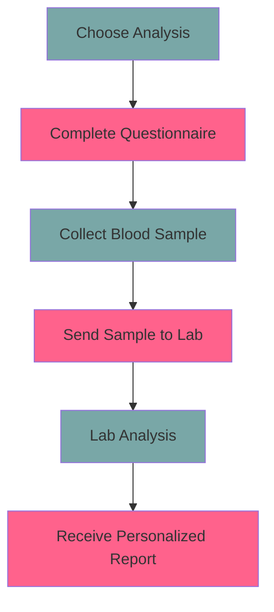

# Unlock Your Full Potential

Welcome to **HealthBioCare**, your gateway to unlocking the secrets of your unique health profile. 

Founded in 2011, we specialize in **preventive health management** through a holistic approach, providing personalized nutrition and lifestyle recommendations based on genetic and epigenetic analyses.

Our mission is to **empower you** with the knowledge of your unique metabolic makeup, enabling you to make minor yet impactful adjustments to your lifestyle. 
We believe that everyone is unique, and so is their health and metabolism. Our work is centered on revealing the hidden information behind your genes and epigenetics, thus paving the way for you to **unleash your full potential**.

## How We Work
Our process is **simple, convenient, and efficient**:

1. Choose the desired analysis: We offer a variety of panels, including Metabolic Type, Sports, Stress, and Aging.
2. Complete the questionnaire: This can be done online or using our printed form.
3. Collect a blood drop sample.
4. Send the sample to our lab for testing.
5. Receive your personalized analysis report with recommendations via email.


## Why trust us?
Our highly skilled team of young, motivated, and innovative individuals with a solid scientific background is committed to providing a wide range of tests, products, and services. 

In partnership with international physicians and university groups, we are constantly developing new products to meet the needs of our customers. 

As part of our scientific activities, we are dedicated to **cutting-edge research** on various topics, such as stress and disease prevention, epigenetically active plant extracts, and sports. The results of our studies are regularly published in [peer-reviewed articles](https://eng.healthbiocare.com/publications/).

We have been supporting numerous junior scholars on their path to a career in science.

## Are you ready? 

[Contact us](https://eng.healthbiocare.com/contact/) for personal or medical advice, and we'll quickly schedule a nutrition consultation. 

Welcome to the **future** of personalized health management.

**Welcome to HealthBioCare!**

<br>

```geojson
{"type":"FeatureCollection","features":[{"type":"Feature","geometry":{"type":"Point","coordinates":[16.354357,48.230049]},"properties":{"title":"HealthBioCare office","address":"Nußdorfer Straße 67, Vienna, Austria"}}]}
```
